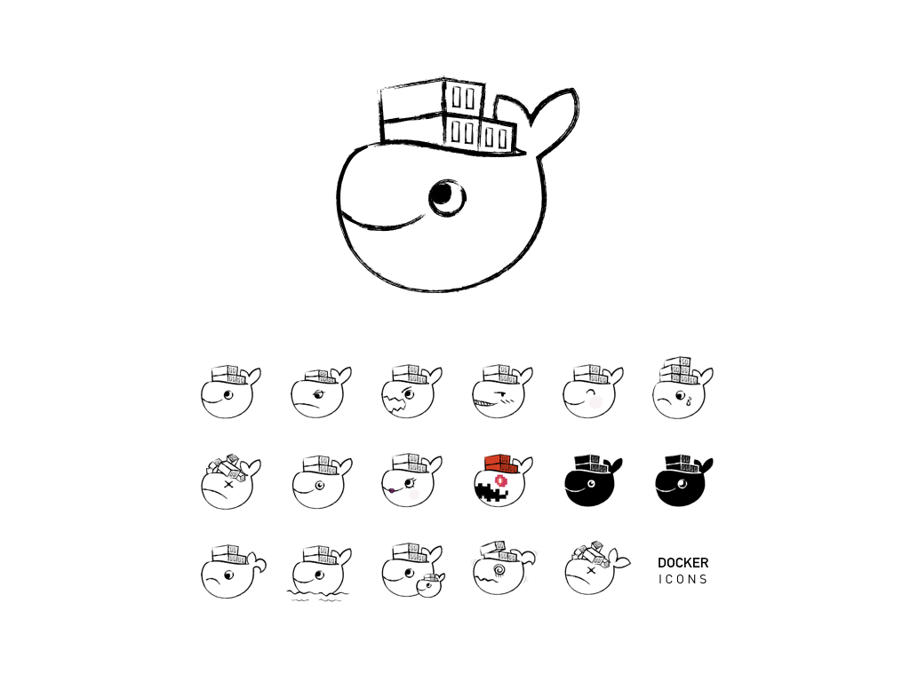

# Docker Icon
I just tried to draw using a keynote. If you want to redraw and change a bit. Download [Docker.key](https://github.com/rhiokim/docker-icons/blob/master/Docker.key?raw=true)

## TODO
* [x] png with transparent background
* [ ] various size
* [ ] black background version

## License
MIT
